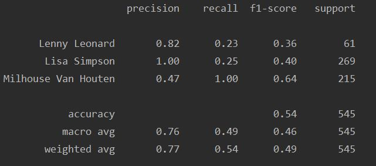

# ЛР 6: "Классификаторы на основе нейронных сетей прямого распространения"

## Задача
1. Установить библиотеку keras, tensorflow.
2. Скачать датасет с симпсонами варианту (для каждого класса отдельная директория).
3. Создать архитектуру нейронной сети прямого распространения с двумя полносвязными скрытыми слоями и сверточной нейронной сети с двумя сверточными и двумя полносвязными слоями и скомпилировать модели (model.summary()).
4. Обучить скомпилированные модели, оценить полноту, точность и аккуратность с помощью classification report.
5. Построить график потерь и точности для каждой модели.
6. Выбрать несколько картинок (не входящих в обучающую и тестовую выборки), определить их класс и подписать на картинках.

## Задание по варианту
Вариант 8(2): Lisa Simpson, Lenny Leonard, Milhouse Van Houten

## Архитектуры нейронный сетей
### 1. Feedforward neural network
На вход нейронной сети подается вектор некоторого фиксированного размера. Чтобы его получить, мы сначала приведем исходное изображение к фиксированному размеру (32x32), а затем "вытянем" его в вектор при помощи функции `flatten()`.

Фреймворк `keras` позволять построить нейронную сеть требуемой архитектуры.
Посколько входные данные представляют собой изображения 32x32, каждый пиксель состоит из трёх цветов (трёх каналов), то размерность входа нашей сети 32 * 32 * 3 = 3072.

Чаще всего для внутренних слоёв используют размер слоя кратный степени числа 2 и функцию активации **sigmoid**.

На последнем слое в роли функции активации используется функция **softmax**. Она оптимально сгладит вероятности и поможет избавиться от выбросов.

Таким образом, получаем следующую архитектуру:

Total params: 3,673,091 - количество весов

На основе полученных данных можно построить график зависимости функции потерь и точности от количества эпох:

Заметим, что при увеличении количества эпох точность растёт до определнного момента, выхода на плато, а затем, в среднем, она не увеличивается. Аналогично с функцией потерь.

В конце обучения выведем отчет:

## 2. Convolutional neural network

В свёрточной нейронной сети входные данные подготавливаются.
То есть мы применяем к изображению свёртку с некоторым ядром, применяем операцию pooling, снижая размерность, но сохраняю структуру, а затем подаём классификатору.

В предложенной нейронной сети выполняется следующая последовательность действий (pooling - MaxPool: выбирает максимум):
1. Свёртка с ядром 5x5
2. Pooling 2x2
3. Свёртка с ядром 3x3
4. Pooling 2x2
5. Flatten

Аналогичным образом построим график зависимости:

Заметим, что для данной модели нейронной сети уже на 20 эпохах обучение можно закончить.

Сверточная сеть гораздо лучше справляется с данной задачей:

