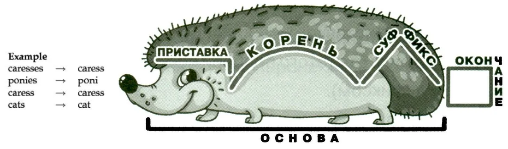
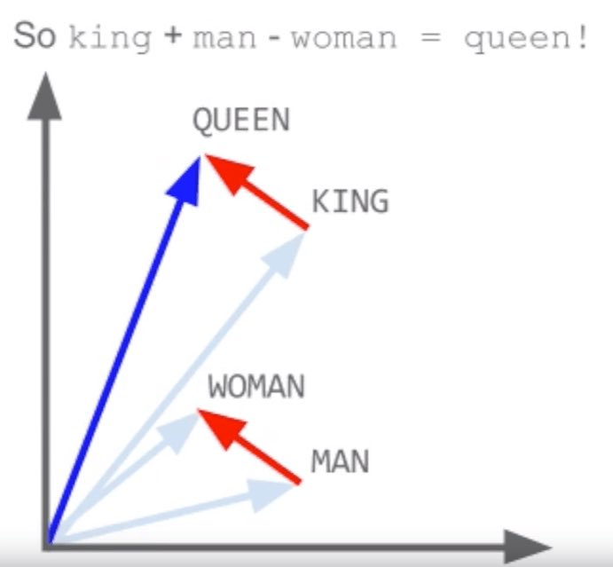
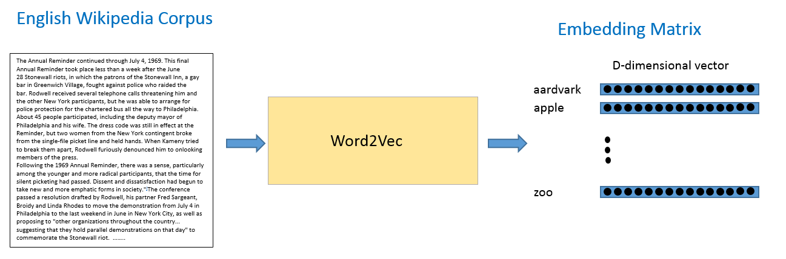
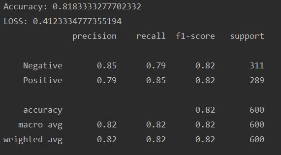
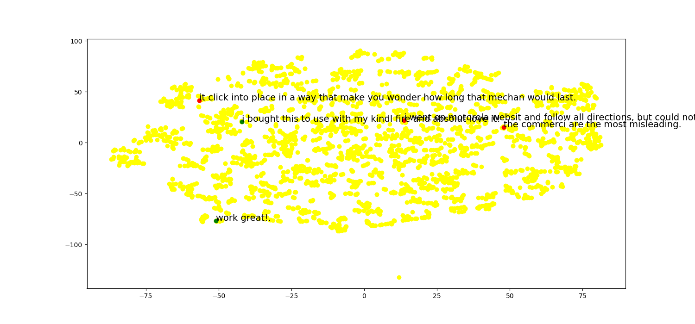
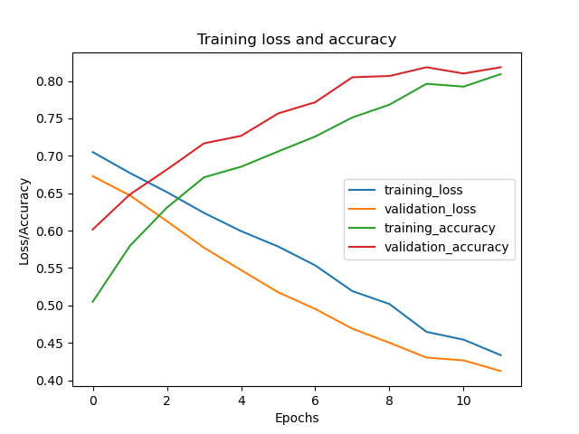

# ЛР 7: "Анализ тональности текстов (RNN)."

## Задача
1.	Установить библиотеку nltk, gensim.
2.	Скачать датасет  c размеченным текстом (позитивный / негативный).
3.	Обработать тексты стеммеров, удалить частые слова (stopwords).
4.	Скачать предобученную модель Word2Vec (или самому обучить), с ее помощь получить векторное представление слов.
5.	Создать архитектуру нейронной сети с Embedding слоем, рекуррентным слоем (LSTM) и полносвязным слоем, скомпилировать модель (model.summary()).
6.	Обучить модель, оценить полноту, точность и аккуратность с помощью classification report.
7. Выбрать несколько предложений, определить их класс (позитивный или негативный) и визуализировать с помощью TSNE модели.

## Постановка задачи

Анализ тональности текста позволяет выявить в по тексту эмоции автора. В нашем случае рассматривается бинарная классификация: позитивный или негативный.

В качестве нейронной сети выступает нейронная сеть с архитектурой **многие к одному** (много входов и один выход).
На вход подаются слова рецензии, на выходе получаем оценку её тональности: позитивная или негативная.

## Алгоритм
1. Считываем датесет (Комментарий, оценка)
2. Предобработка текста

Для этого применим **stemmer**.
Stemmer находит основу (по русски - корень) слова и заменяет им изначальное слово.
Таким образом мы получаем нормализованный текст со значимыми словами.

3. Преобразование слов в векторы

Для дальнейшей работы с текстом требуется преобразовать слова в векторы (для работы как с фичами).
Здесь нам помогает модель машинного обучения **Word2Vec**.
На основе подаваемого текста модель находит точку в некотором n-мерном пространстве. При этом сохраняется отношение между словами (векторные представления близких слов находятся рядом).

Существую уже предобученные модели, например, **glove-twitter-25**.

4. Подготовка к построению нейронной сети

Создаем матрицу (embedding), где строки - все слова словаря, столбцы - представление слова в пространстве. Т.е. слова и их координаты.

Затем заполняем эту матрицу по словарю (исходным словам из комментариев) при помощи значений в предобученной модели.

5. Строим модель нейронной сети

Комментарии имеют различную длину, embedding позволяет привести все вектора к единуму размеру, чтобы мы могли передать их на следующие слои.

Затем идет LSTM слой получает контекст из этих векторов и подает на третий слой.

И в конце полносвязный слой с одним нейроном и функцией активации сигмоида, определяющий класс комментария (0 - негативный, 1 - позитивный).

## Результаты

По тестовой выборке оценим работу полученной сети.

Для наглядности расположения точек, воспользуемся моделью TSNE и преобразуем наши векторы в точки двухмерного пространства.

А также построим график зависимости функции потерь и точности от количества эпох.

