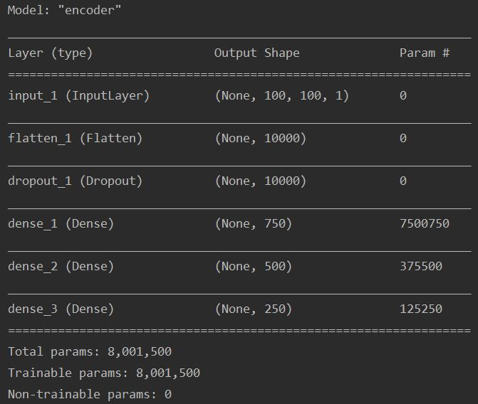
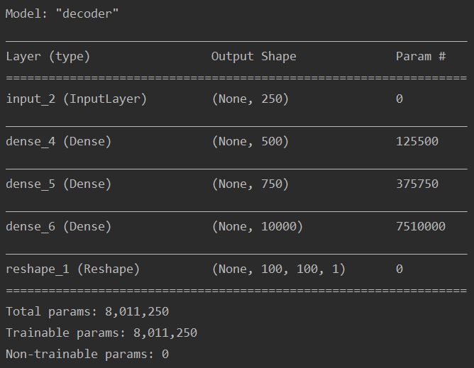
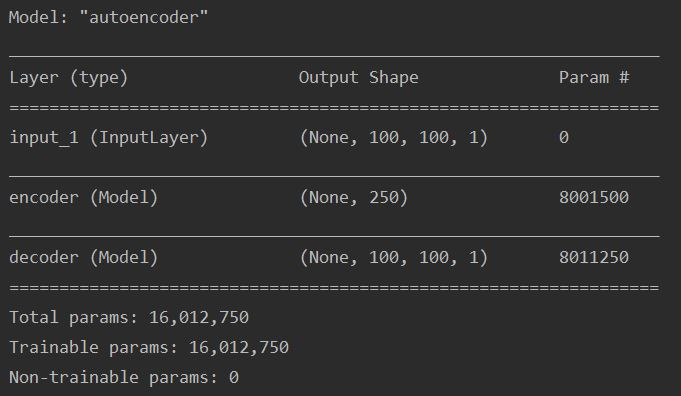
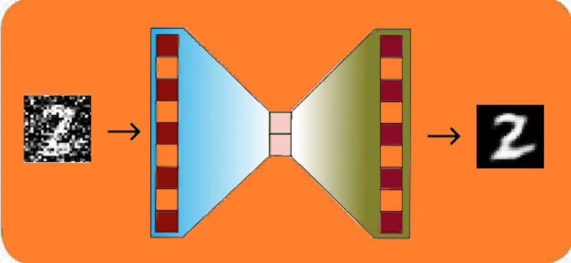
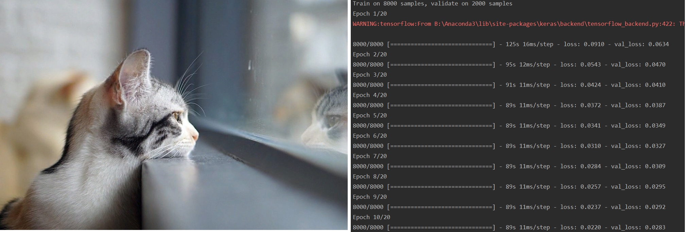
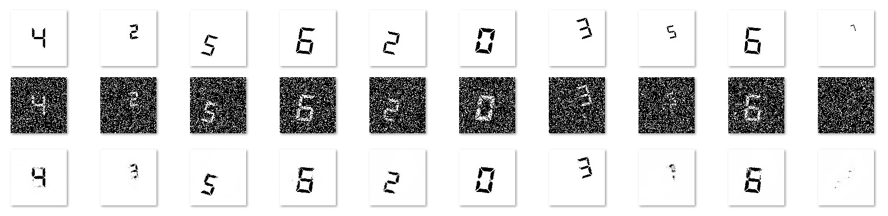
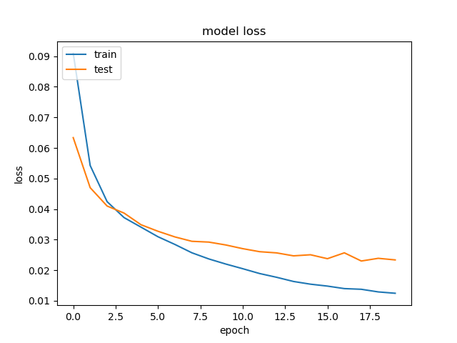

# ЛР 8: "Автокодировщики"

## Задача
1.	Скачать датасет  c изображениями цифр.
2.	Сгенерировать несколько изображений с шумом.
3.	Создать модель шумоподавляющего (denoising) автокодировщика с двумя полносвязными слоями, скомпилировать модель (model.summary()).
4.	Обучить модель, построить график потерь.
5.	Восстановить несколько изображений с шумом с помощью модели обученной нейронной сети и сохранить.

## Постановка задачи

Автокодировщик (Autoencoder) – нейронная сеть, которая пытается максимально приблизить значения выходного сигнала к входному, т.е. наилучшим образом аппроксимировать тождественное преобразование.

Автокодировщик состоит из двух частей: кодер и декодер.

Кодер (***h=g(x)***), исходя из названия, представляет поданные ему данные в некотором коде, т.е. кодирует их.

Декодер (***y=f(h)***), наоборот, восстанавливает по коду вход.

Таким образом, автокодировщик пытается подобрать функции ***f*** и ***g*** таким образом, чтобы минимизируя функцию потерь ***loss(x, f(g(x)))*** получить тождество ***y=f(g(x))***

В нашем случае автокодировщик будет избавляться от шумов на изображении.
Важно, что обучив автокодировщик избаляться от шумов на цифрах, мы не можем использовать его, например, для обработки звуковой информации.

## Алгоритм
1. Считываем датесет

Датасет довольно большой, по 1000 изображений на каждую цифру.
Размеры - 100x100

2. Предобработка изображений

Конвертируем из цветного (RGB) в ч/б

3. Создаём нейронную сеть

Как мы сказали, сначала изображения кодируются.
Создаём кодер (кодовое расстояние d=250):

Итак, входной слой размерности 100x100 с одним каналом (ч/б изображение).
Затем массив преобразуем в вектор размера 100x100=10 000.
Для борьбы с переобучением добавим 15% dropout.
Далее идут пара вспомогательных полнисвязных слоя 3d и 2d.
И выход размера d.

Декодер:

По сути, обратен кодеру, теперь мы не сжимаем, а раздуваем вектор.

Вход декодера соответствует выходу кодера.
Затем вспомогательные слои 2d и 3d.
В конце восстанавливаем размеры исходного изображения 10 000.
И преобразуем обратно в массив 100x100 с одним каналом.

Склеиваем кодер и декодер - получаем автокодировщик:

4. Наложение шума и обучение

Разбиваем наш датасет на обучающую и тестовую выборку, накладываем шум и обучаем сеть в соответствии со схемой.

Будем подавать на вход зашумлённые изображения и корректировать веса так, чтобы получить те же изображения без шума.

Изображения довольно большие, а, соответственно размерности и количество весов, долго и упорно ожидаем...

## Результаты

Спустя 30 минут получаем вполне приличный результат!

Да, для изображений с маленькими цифрами выходит не очень хорошо, шума много, но с более крупными сеть вполне достойно справляется.

Остаётся построить график зависимости функции потерь от количества эпох.

